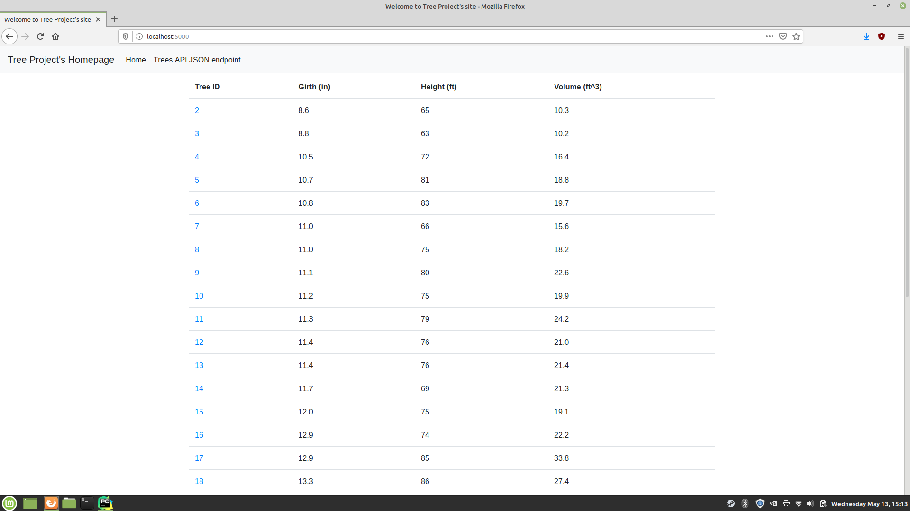

# Final Project: Trees
Python Flask management system to view/edit/create/delete tree data in a MySQL database.

# index.html

# View Record

# Adding a New Record

### Record 32 Added

# Updating a Record

### Record 1 Updated

# Deleting a Record
Tree Record 1 was deleted.

